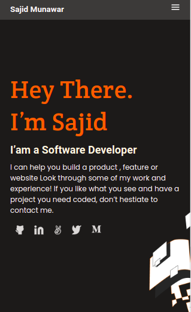

# Portfolio

> This is a Portfolio project. In this project I've used simple html and css firstly then Javascript to manipulations DOM. In this project I've used Javascript objects also. 

## Built With

- HTML
- CSS 
- Javascript

## Getting Started

To get a local copy up and running follow these simple example steps.

- Clone repository in your local machine 
- git clone https://github.com/sajid-munawar/Portfolio.git
- cd Portfolio
- open `index.html` in your browser.
- You can use live server.

## Live Demo
[Live Demo Link](https://sajid-munawar.github.io/Portfolio/)

## Authors

👤 **Sajid Munawar**

- GitHub: [@githubhandle](https://github.com/sajid-munawar)
- LinkedIn: [LinkedIn](https://www.linkedin.com/in/sajid-munawar-41ba26180/)

## 🤝 Contributing

Contributions, issues, and feature requests are welcome!

Feel free to check the [issues page](../../issues/).

## Show your support

Give a ⭐️ if you like this project!

## Acknowledgments

- Hat tip to anyone whose code was used
- Inspiration
- etc

